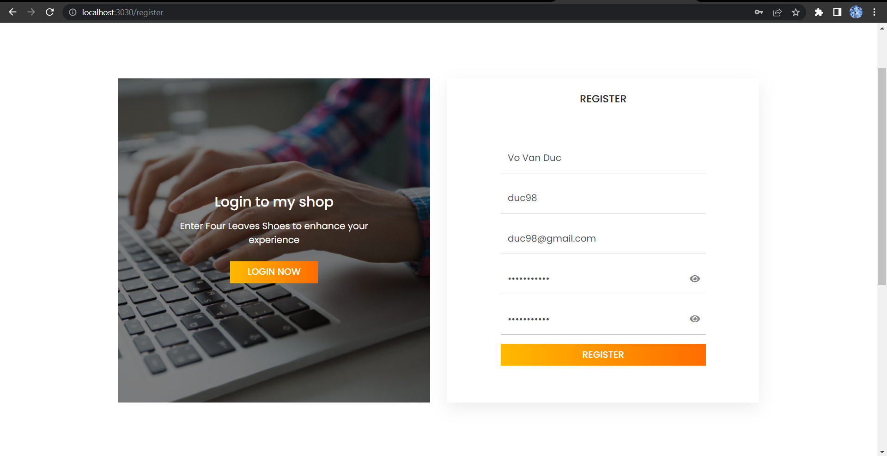
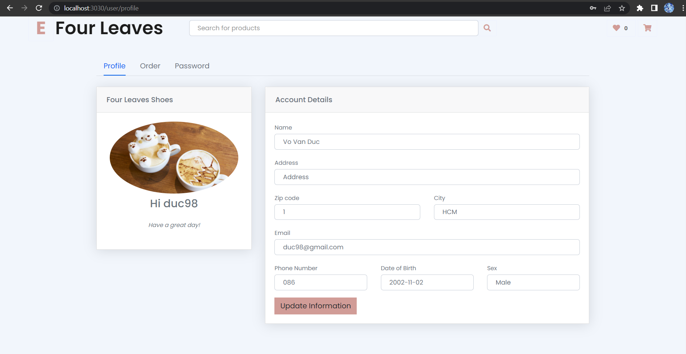

## Phần 1: Spring boot crud, các thao tác tra cứu, mua hàng
### Structure project
```
com.data.filtro
├── api
├── config
├── controller
├── exception
├── model
├── repository
├── service
├── util
└── FiltroApplication.java
```

### Model
Đầu tiên ta tiến hành tạo tất cả các model và định nghĩa các quan hệ
giữa chúng từ bảng thiết kế class diagram.

Ví dụ tạo model Contact
```
package com.data.filtro.model;
import com.fasterxml.jackson.annotation.JsonBackReference;
import com.fasterxml.jackson.annotation.JsonIgnore;
import jakarta.persistence.*;
import lombok.AllArgsConstructor;
import lombok.Data;
import lombok.EqualsAndHashCode;
import lombok.NoArgsConstructor;
import org.springframework.stereotype.Component;

import java.util.Date;

@Entity
@Table(name = "lienhe")
@Data
@Component
@AllArgsConstructor
@NoArgsConstructor
public class Contact {
    @Id
    @GeneratedValue(strategy = GenerationType.IDENTITY)
    @Column(name = "id")
    private Integer id;

    @Column(name = "ten")
    private String name;

    @Column(name = "email")
    private String email;

    @Column(name = "chude")
    private String subject;

    @Column(name = "tinnhan")
    private String message;
}

```

Các Annotation:

`@Entity`: Đánh dấu một lớp là một thực thể (entity) trong cơ sở dữ liệu. Thông qua @Entity, lớp được ánh xạ vào một bảng trong cơ sở dữ liệu.

`@Data`: Tự động tạo các phương thức getter, setter, equals, hashCode và toString cho các thuộc tính của lớp.

`@Component`: Đánh dấu một lớp là một bean và được quản lý bởi Spring Container. Annotation này cho phép Spring tự động phát hiện và quản lý các bean trong ứng dụng.

`@NoArgsConstructor` và `@AllArgsConstructor`: Tạo constructor không có
tham số và có tất cả tham số.

`@Table(name = "brands")`: Xác định tên bảng trong database.

---
Tương tự ta tạo model Product
```
package com.data.filtro.model;


import com.fasterxml.jackson.annotation.*;
import jakarta.persistence.*;
import lombok.AllArgsConstructor;
import lombok.Data;
import lombok.NoArgsConstructor;
import lombok.ToString;

import java.io.Serializable;
import java.util.Date;
import java.util.List;

@Entity
@Table(name = "sanpham")
@Data
@ToString(exclude = {"material", "category", "cartItemList"})
// muốn loại bỏ khỏi kết quả của phương thức toString()
@AllArgsConstructor
@NoArgsConstructor
public class Product implements Serializable {
    @Id
    @GeneratedValue(strategy = GenerationType.IDENTITY)
    @Column(name = "masp")
    private Integer id;

    @Column(name = "tensanpham")
    private String productName;

    @Column(name = "soluong")
    private Integer quantity;

    @Column(name = "daban")
    private Integer sold;

    @Column(name = "giatien")
    private Integer price;

    @ManyToOne(fetch = FetchType.EAGER)
    @JoinColumn(name = "mavatlieu", referencedColumnName = "mavatlieu")
    @JsonManagedReference
    private Material material;

    @Column(name = "mota")
    private String description;

    @Column(name = "anh")
    private String image;

    @Column(name = "ngaytao")
    private Date createdDate;

    @Column(name = "tinhtrang")
    private Integer status;

    @Column(name = "giamgia")
    private Integer discount;

    @ManyToOne(fetch = FetchType.EAGER)
    @JoinColumn(name = "madanhmuc", referencedColumnName = "madanhmuc")
    //@JsonManagedReference
    private Category category;

    @OneToMany(mappedBy = "product", cascade = CascadeType.ALL, fetch = FetchType.LAZY)
    @JsonIgnore
    private List<CartItem> cartItemList;

    @OneToMany(mappedBy = "product", cascade = CascadeType.ALL, fetch = FetchType.LAZY)
    @JsonIgnore
    private List<OrderDetail> orderDetails;

    @OneToMany(mappedBy = "product", cascade = CascadeType.ALL, fetch = FetchType.LAZY)
    @JsonIgnore
    private List<InvoiceDetail> invoiceDetails;
}

```
- `@Nullable`: Chú thích chỉ ra rằng một trường hoặc tham số có thể có giá trị null.
- `@ToString(exclude = {"material", "category", "cartItemList"})`: Tạo phương thức `toString()` cho lớp, loại trừ các thuộc tính được chỉ định khỏi chuỗi biểu diễn.
- `@Id`: Đánh dấu một trường là khóa chính của đối tượng.
- `@GeneratedValue(strategy = GenerationType.IDENTITY)`: Xác định chiến lược sinh giá trị cho khóa chính tự động.
- `@Column(name = "masp")`: Ánh xạ một trường với một cột trong cơ sở dữ liệu, chỉ định tên cột tương ứng.
- `@ManyToOne(fetch = FetchType.EAGER)`: Xác định một mối quan hệ nhiều-đến-một giữa các đối tượng, với việc tải dữ liệu liên quan một cách tức thì.
- `@JoinColumn(name = "mavatlieu", referencedColumnName = "mavatlieu")`: Xác định cột liên kết trong một mối quan hệ nhiều-đến-một.
- `@JsonManagedReference`: Xác định một mối quan hệ quản lý JSON, giúp ngăn ngừa vòng lặp trong quá trình chuyển đổi thành JSON.
- `@JsonIgnore`: Chỉ định rằng một thuộc tính hoặc phương thức sẽ bị bỏ qua và không tham gia vào quá trình chuyển đổi JSON.

**Cuối cùng: Làm tương tự với các model khác dựa trên
class diagram đã thiết kế**


### Repository
Tạo interface ContactRepository trong package repository
```
package com.data.filtro.repository;

import com.data.filtro.model.Contact;
import com.data.filtro.model.Feedback;
import org.springframework.data.jpa.repository.JpaRepository;
import org.springframework.data.jpa.repository.Query;
import org.springframework.data.repository.query.Param;

import java.util.List;

@Repository
public interface ContactRepository extends JpaRepository<Contact, Integer> {
    @Query("SELECT f FROM Contact f")
    List<Contact> loadContact();

}

```
- `@Repository`: Đây là một annotation của Spring Framework, được sử dụng để đánh dấu interface này là một repository, tức là một thành phần dùng để truy cập và thao tác dữ liệu từ cơ sở dữ liệu.
- `ContactRepository`: Đây là một interface, mở rộng từ JpaRepository, cung cấp các phương thức tiêu chuẩn để thao tác với dữ liệu của lớp Contact.
- `JpaRepository<Contact, Integer>`: Đây là một interface của Spring Data JPA, cung cấp các phương thức cơ bản cho việc truy vấn và thao tác dữ liệu trong cơ sở dữ liệu.Contact là kiểu dữ liệu của đối tượng trong repository, và Integer là kiểu dữ liệu của khóa chính.
- `@Query("SELECT f FROM Contact f")`: Đây là một annotation của Spring Data JPA, được sử dụng để chỉ định một truy vấn tùy chỉnh. Truy vấn này lấy tất cả các đối tượng Contact từ cơ sở dữ liệu.

Tương tự có nhiều annotation khác được sử dụng trong các file repository để có thể truy xuất dữ liệu từ database như:
- `@Repository`: Đánh dấu một lớp là một Repository, định nghĩa một bean Spring để thao tác với cơ sở dữ liệu.
- `@Query`: Định nghĩa một truy vấn tùy chỉnh trong Repository, cho phép thực hiện truy vấn không dựa trên tên phương thức.
- `@Param`: Xác định một tham số trong một truy vấn được đặt tên, liên kết với một tham số trong phương thức Repository tương ứng.
- `@EntityGraph`: Định nghĩa một Entity Graph để quản lý việc tải dữ liệu liên quan khi thực hiện truy vấn.
- `@Transactional`: Đánh dấu một phương thức hoặc lớp là một phần của giao dịch, đảm bảo tính toàn vẹn và nhất quán dữ liệu.
### Service
Ta tiến hành tạo một class ContactService sử dụng annotation @Service.
```
package com.data.filtro.service;

import com.data.filtro.model.Contact;
import com.data.filtro.model.Feedback;
import com.data.filtro.repository.ContactRepository;
import org.springframework.beans.factory.annotation.Autowired;
import org.springframework.stereotype.Service;

import java.util.ArrayList;
import java.util.Date;
import java.util.List;

@Service
public class ContactService {
    @Autowired
    private ContactRepository contactRepository;
    public void createContact(Contact contact) {
        contactRepository.save(contact);
    }
    public List<Contact> loadAllContact(){
        List<Contact> contacts = new ArrayList<>();
        contacts = contactRepository.loadContact();
        return contacts;
    }
}

```

- `@Service`: Đánh dấu một lớp là một Service trong kiến trúc dự án. Annotation này cho phép Spring quản lý và tự động cung cấp các instance của lớp này khi được yêu cầu.
- `@Autowired`: Đánh dấu một trường hoặc phương thức là một dependency injection. Khi ContactService được khởi tạo, Spring sẽ tự động cung cấp một instance của ContactRepository thông qua dependency injection, từ đó có thể sử dụng những phương thức đã được định nghĩa ở trong ContactRepository.
- `ContactRepository`: Interface được sử dụng để thao tác với cơ sở dữ liệu, cung cấp các phương thức để lưu, truy vấn và tương tác với đối tượng Contact trong cơ sở dữ liệu.
- `createContact()`: Phương thức trong ContactService nhận một đối tượng Contact và sử dụng contactRepository để lưu đối tượng đó vào cơ sở dữ liệu.
- `loadAllContact()`: Phương thức trong ContactService truy vấn danh sách tất cả các Contact từ cơ sở dữ liệu bằng cách gọi phương thức loadContact() trong contactRepository và trả về danh sách Contact được truy vấn.

### Controller
Tiếp theo tạo ContactController trong package controller
```
package com.data.filtro.controller.user;

import com.data.filtro.model.Contact;
import com.data.filtro.model.Feedback;
import com.data.filtro.model.User;
import com.data.filtro.service.ContactService;
import jakarta.servlet.http.HttpSession;
import org.springframework.beans.factory.annotation.Autowired;
import org.springframework.stereotype.Controller;
import org.springframework.ui.Model;
import org.springframework.web.bind.annotation.*;

@Controller
@RequestMapping("/contact")
public class ContactController {

    @Autowired
    private ContactService contactService;
    @GetMapping
    public String loadContactPage(){
        return "user/boot1/contact";
    }

    @PostMapping
    public String addContact(@RequestParam("name") String name,
                             @RequestParam("email") String email,
                             @RequestParam("subject") String subject,
                             @RequestParam("message") String message,
                             HttpSession session, Model model) {
        Contact contact = new Contact();
        contact.setName(name);
        contact.setEmail(email);
        contact.setSubject(subject);
        contact.setMessage(message);
        contactService.createContact(contact);
        return "redirect:/contact";
    }
}

```

- `@Controller`: Annotation được sử dụng để đánh dấu lớp ContactController là một controller trong Spring MVC. Nó chỉ ra rằng lớp này sẽ xử lý các yêu cầu HTTP từ client.
- `@RequestMapping("/contact")`: Annotation được sử dụng để ánh xạ URL /contact tới controller ContactController. Khi có một yêu cầu HTTP đến đường dẫn /contact, controller này sẽ xử lý yêu cầu đó.
- `@Autowired`: Annotation được sử dụng để tiêm (inject) một instance của ContactService vào biến contactService. Điều này cho phép chúng ta truy cập và sử dụng các phương thức của ContactService trong controller mà không cần tạo instance một cách rõ ràng.
- `@GetMapping`: Annotation được sử dụng để ánh xạ phương thức loadContactPage() với yêu cầu HTTP GET tới đường dẫn /contact. Khi có một yêu cầu GET đến đường dẫn /contact, phương thức này sẽ được gọi để xử lý yêu cầu đó.
- `@PostMapping`: Annotation được sử dụng để ánh xạ phương thức addContact() với yêu cầu HTTP POST tới đường dẫn /contact. Khi có một yêu cầu POST đến đường dẫn /contact, phương thức này sẽ được gọi để xử lý yêu cầu đó.
- `@RequestParam`: Annotation được sử dụng để đánh dấu các tham số của phương thức addContact(). Nó chỉ định rằng các tham số này sẽ được lấy từ các trường name, email, subject, message của yêu cầu HTTP.
- `HttpSession`: Tham số của phương thức addContact() để lưu trữ thông tin về phiên làm việc hiện tại.
- `Model`: Tham số của phương thức addContact() để truyền dữ liệu từ controller tới view.
return "redirect:/contact": Câu lệnh trả về chuỗi  "redirect:/contact", làm chuyển hướng yêu cầu đến đường dẫn /contact.

Bởi vì Model contact được khách hàng sử dụng để phản hồi về dịch vụ, nên model này chỉ được thêm, mà không được thiết kế để xóa, chỉnh sửa nên sẽ demo thay thế bằng model Account.


**create**


**update**



