# FourLeavesShoes - Giới thiệu đồ án

FourLeavesShoes là một website bán giày trực tuyến với đầy đủ chức năng cho cả người bán và người mua. Website này được thiết kế để đáp ứng nhu cầu mua sắm giày của khách hàng và giúp người bán quản lý thông tin sản phẩm, người dùng và các hoạt động kinh doanh.

## Chức năng cho người bán
### Tài khoản cho người bán (vì web chỉ tạo ra 1 tài khoản duy nhất cho admin)
- Tài khoản: admin
- Mật khẩu: 123

Người bán có quyền truy cập vào các chức năng quản lý sau:

- CRUD (Create, Read, Update, Delete) người dùng: Người bán có thể thêm, xem, cập nhật và xóa thông tin người dùng. Điều này cho phép họ quản lý danh sách khách hàng, thông tin cá nhân và địa chỉ giao hàng.
- CRUD sản phẩm: Người bán có thể thêm, xem, cập nhật và xóa thông tin sản phẩm. Họ có thể quản lý danh mục sản phẩm, mô tả, giá cả, số lượng tồn kho và hình ảnh sản phẩm.
- CRUD loại sản phẩm: Người bán có thể thêm, xem, cập nhật và xóa thông tin loại sản phẩm. Điều này cho phép họ phân loại sản phẩm vào các danh mục khác nhau để dễ dàng tìm kiếm và duyệt.
- ...

## Chức năng cho người mua

Người mua có quyền truy cập vào các chức năng sau:

- Quản lý giỏ hàng: Người mua có thể thêm sản phẩm vào giỏ hàng, xóa sản phẩm hoặc cập nhật số lượng sản phẩm trong giỏ hàng.
- Quản lý thông tin cá nhân: Người mua có thể cập nhật thông tin cá nhân như địa chỉ giao hàng, thông tin liên hệ và thông tin thanh toán.
- Xem sản phẩm: Người mua có thể duyệt qua danh sách sản phẩm, xem chi tiết sản phẩm, mô tả, giá cả và hình ảnh sản phẩm.
- Đặt hàng: Người mua có thể đặt hàng thông qua giao diện đơn giản và tiện lợi. Họ có thể chọn sản phẩm, xác nhận đơn hàng và thực hiện thanh toán.
- ...

## Bảo mật

FourLeavesShoes đã được xây dựng với những biện pháp bảo mật sau đây để đảm bảo an toàn cho người dùng:

- Bảo vệ khỏi cuộc tấn công CSRF (Cross-Site Request Forgery): FourLeavesShoes sử dụng các anti-CSRF token để kiểm tra tính hợp lệ của các yêu cầu từ người dùng và ngăn chặn cuộc tấn công CSRF.
- Bảo vệ khỏi cuộc tấn công Brute Force: FourLeavesShoes áp dụng chính sách đặt mật khẩu để ngăn chặn cuộc tấn công Brute Force.
- Bảo vệ khỏi cuộc tấn công Clickjacking: FourLeavesShoes sử dụng HTTP header frame options để ngăn chặn cuộc tấn công Clickjacking.
- Bảo vệ khỏi cuộc tấn công XSS (Cross-Site Scripting): FourLeavesShoes áp dụng các biện pháp lọc đầu vào và mã hóa đầu ra bằng công nghệ Thymeleaf để ngăn chặn cuộc tấn công XSS.

Đồ án FourLeavesShoes cung cấp một trải nghiệm mua sắm trực tuyến an toàn và thuận tiện cho người dùng, đồng thời cung cấp cho người bán các công cụ quản lý linh hoạt để điều hành hoạt động kinh doanh.

# Giải thích code

## Phần 1: Spring boot crud, các thao tác tra cứu, mua hàng
Tìm hiểu các kiến trúc, cách chia các package, cách thức thêm, đọc, xóa, chỉnh sửa dữ liệu.

[Link chi tiết](/ReadmeFiles/crud.md)

(Bấm vào link để xem hoặc vào `crud.md`)

## Phần 2: Spring Security
Tìm hiểu cách cấu hình Authentication và Authorization cơ bản.

Tìm hiểu cách phòng chống các thuộc tấn công CSRF, Brute Force, XSS và ClickJacking

[Link chi tiết](/ReadmeFiles/security.md)

(Bấm vào link để xem hoặc vào `security.md`)

## Phần 3: Xử lý Exception and Validation
Tìm hiểu cách tạo các exception và xử lý các exception chung.

[Link chi tiết](/ReadmeFiles/exception.md)

(Bấm vào link để xem hoặc vào `exception.md`)

## Phần 4: Tối ưu hiệu suất và bộ nhớ Cache

## Phần 5: Testing and Logging

## Phần 6: Spring Cloud

# Demo
# Với Guess, có các chức năng như sau:
- Đăng nhập
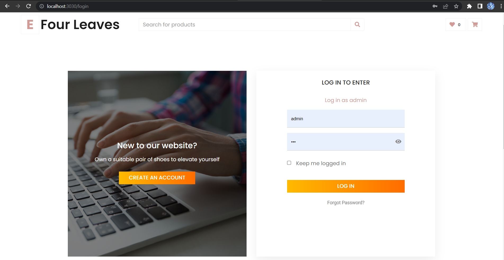

- Đăng ký
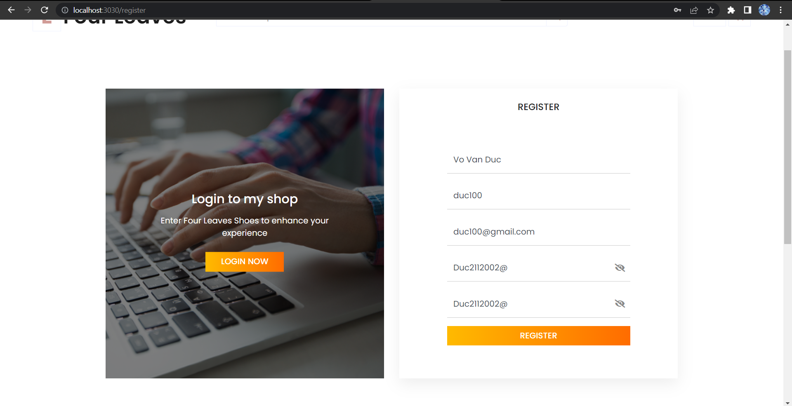

- Xem, tra cứu sản phẩm
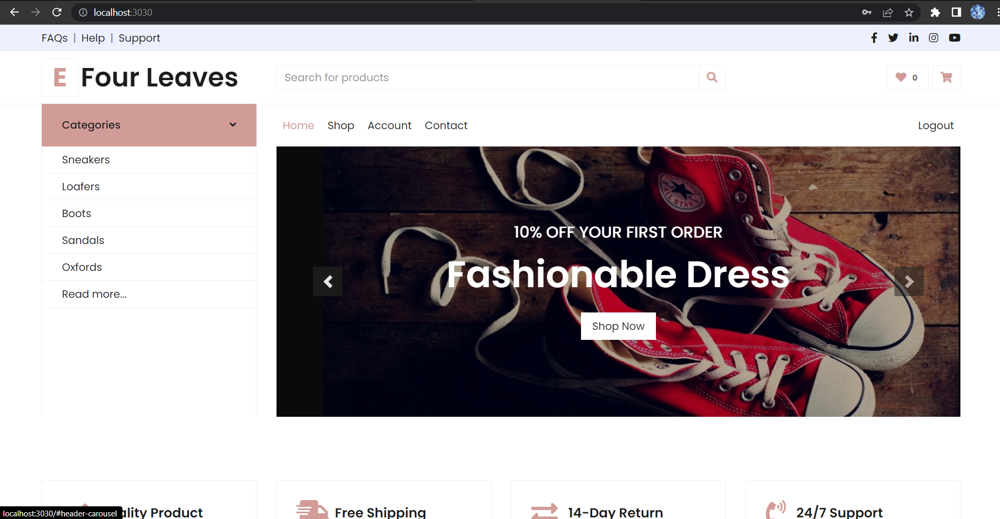

- 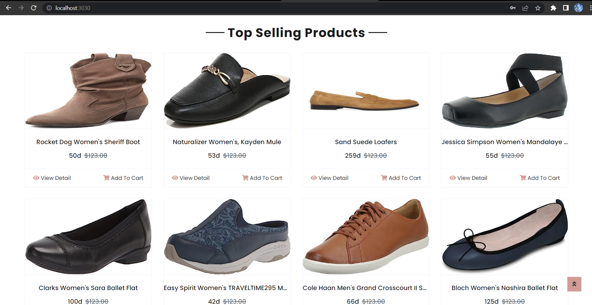

- Phản về về web (lỗi trong đăng nhập, đăng ký)
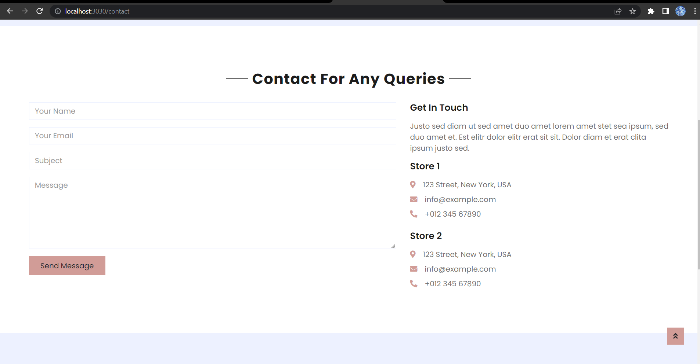

- Thêm sản phẩm vào giỏ hàng tạm thời, nếu đăng nhập thì những sản phẩm đó sẽ được thêm vào giỏ hàng của user.
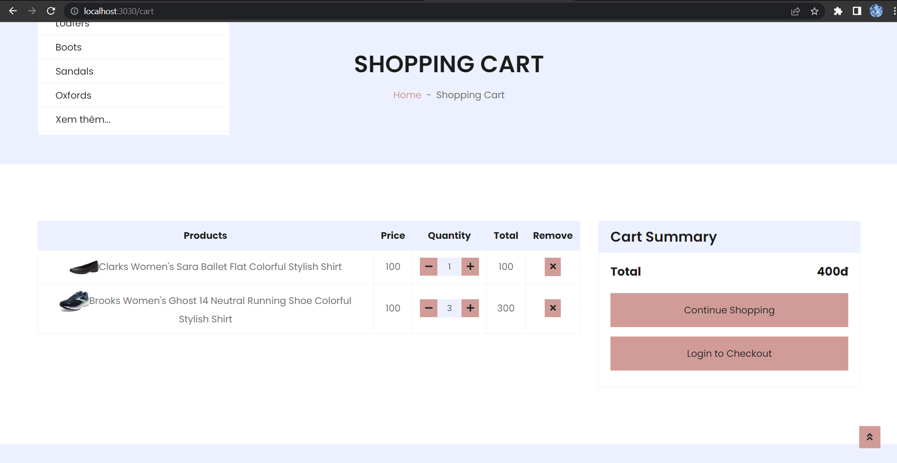

# Với User, có các chức năng như sau:
- Có các chức năng kế thừa từ Guess
- Đặt đơn hàng, thanh toán hóa đơn.
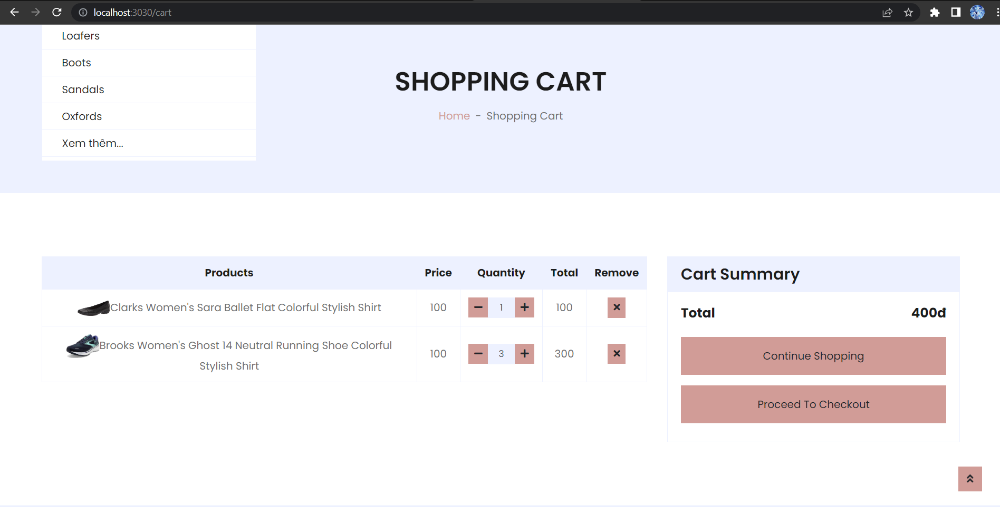

- 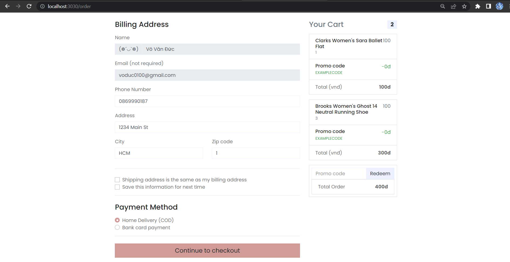

- 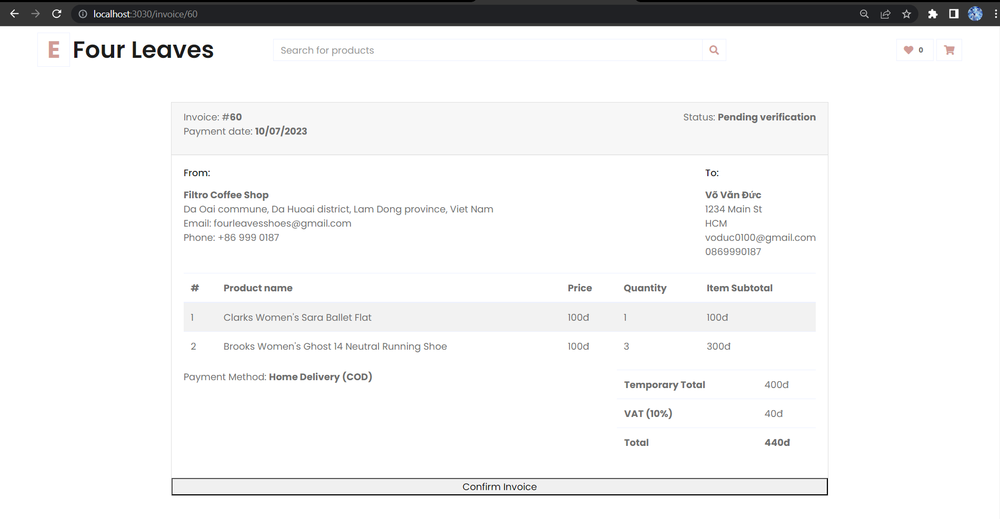

- Chỉnh sửa thông tin tài khoản.
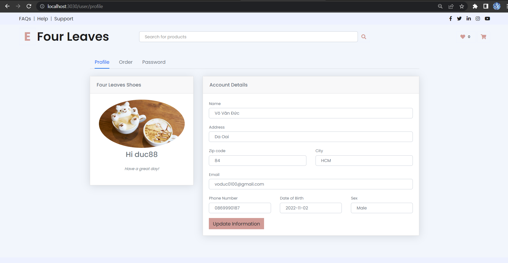

- Xem lịch sử đặt hàng
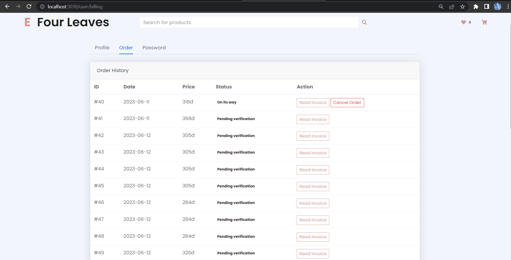

- Đổi mật khẩu.
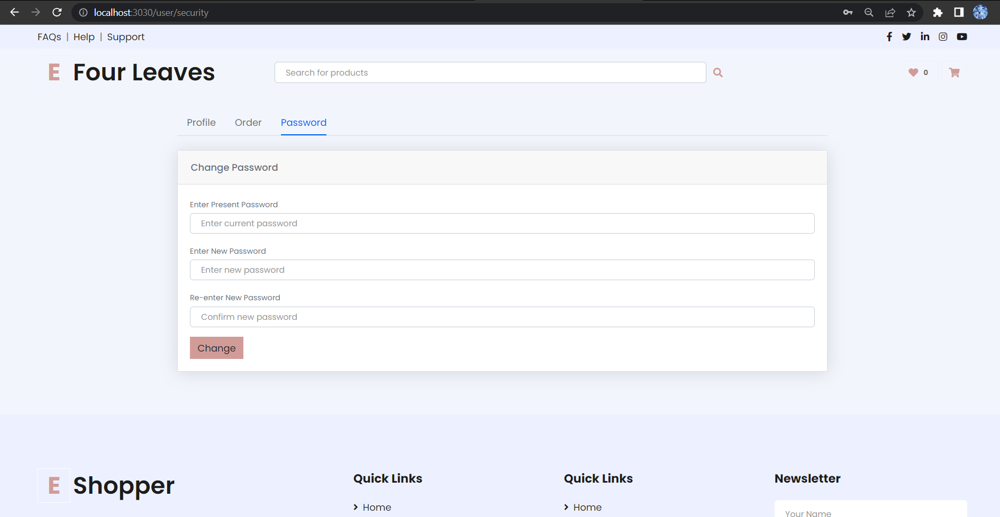

# Với Admin (tài khoản đăng nhập: 'admin' ; mật khẩu: '123'), có các chức năng chính như sau:
- CRUD Account, Client, Order, Employee, Product, Category, Material
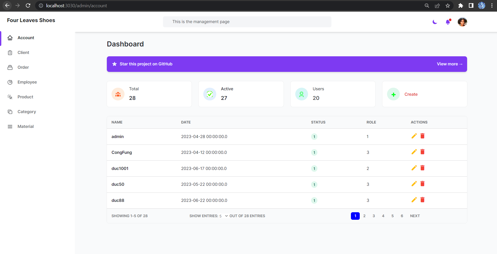

- Create
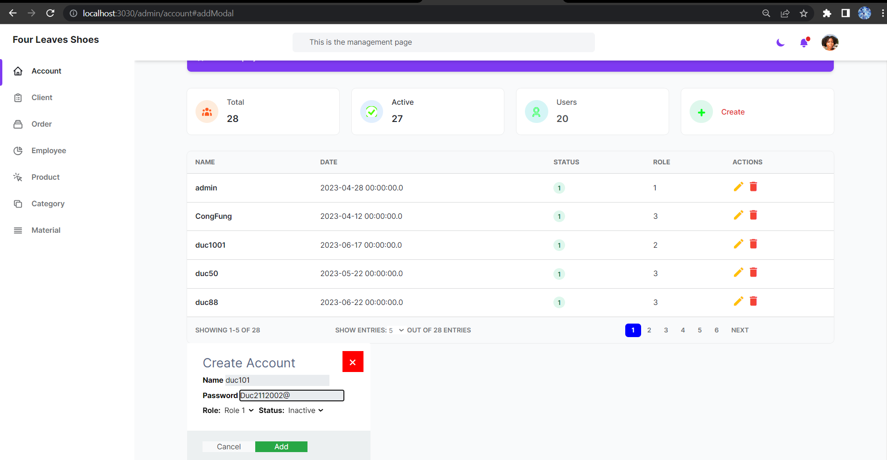

- Update
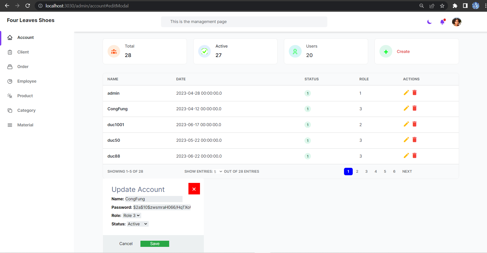

- Delete
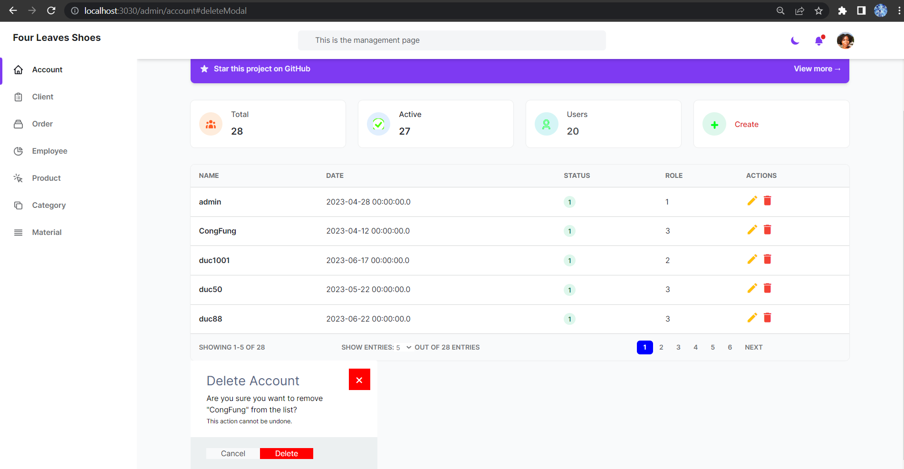
