# Trang web sẽ tiến hành phòng chống các cuộc tấn công CSRF, Brute Force, XSS, ClickJacking
## 1. Authentication và Authorization
Web có 3 role: Guess, User, Admin

Với Guess, có các chức năng như sau:
- Đăng nhập
- Đăng ký
- Xem, tra cứu sản phẩm
- Phản về về web (lỗi trong đăng nhập, đăng ký)
- Thêm sản phẩm vào giỏ hàng tạm thời, nếu đăng nhập thì những sản phẩm đó sẽ được thêm vào giỏ hàng của user.

Với User, có các chức năng như sau:
- Có các chức năng kế thừa từ Guess
- Đặt đơn hàng, thanh toán hóa đơn.
- Chỉnh sửa thông tin tài khoản.
- Đổi mật khẩu.

Với Admin (tài khoản đăng nhập: 'admin' ; mật khẩu: '123'), có các chức năng chính như sau:
- CRUD Account
- CRUD Client
- CRUD Order
- CRUD Employee
- CRUD Product
- CRUD Category
- CRUD Material

## 2. CSRF
CSRF là viết tắt của Cross-Site Request Forgery, có nghĩa là giả dạng request từ site khác mà không phải là site chính chủ.

Cách phòng chống:
#### Cách 1: Sử dụng giao thức HTTPS
Sử dụng HTTPS để Cookie của người dùng chỉ được đọc bởi người dùng và server web chính chủ Filtro, và không thể bị đọc bởi bên thứ 3.
#### Cách 2: Sử dụng Anti-CSRF token
Trong trường hợp không sử dụng giao thức HTTPS, mình sẽ sử dụng Anti-CSRF tokens vào form bình luận trong trang product.html. Tokens này chỉ được cung cấp khi người dùng truy cập vào trang chi tiết sản phẩm, tiến hành nhập bình luận, sau khi nhấn nút “Submit” thì token này sẽ được gửi về Controller ở backend để so sánh. Nếu giống nhau thì mới được tiếp tục xử lý. 

#### Các bước người dùng bình luận với Anti-CSRF tokens:
Bước 1: Người dùng vào trang chi tiết sản phẩm để bình luận, lúc này, request sẽ được gửi về Controller có hàm là product. Người dùng sẽ được cung cấp Anti-CSRS token.

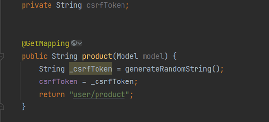

Sử dụng UUID để tạo ra Anti-CSRF token (UUID là một cách thức để tạo ra một chuỗi 32 ký tự)

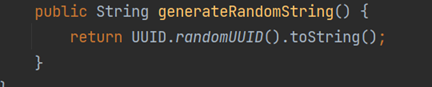

Bước 2: Sau khi cung cấp Anti-CSRF token cho người dùng, controller sẽ chuyển hướng người dùng tới trang product.html.

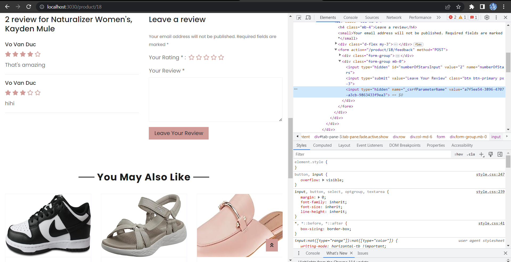

Như trong hình thì CSRF token có giá trị a7f5ee54-3896-4707-a3cb-9863433f9ea3

Bước 3: Sau khi bình luận thì tokens này được gửi kèm với nội dung bình luận để so sánh. Sử dụng input kiểu hidden có tên là “_csrfParameterName” gửi về controller.

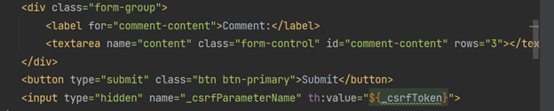

Trong file ProductController.java, controller “feedback” với annotation @PostMapping(“/{id}/feedback) sẽ nhận request trên. Controller tiến hành so sánh xem Anti-CSRF token được gửi từ trang “product.html” có trùng khớp với Anti-CSRF token được lưu trong web không. Nếu không giống nhau thì sẽ không thêm bình luận vào cơ sở dữ liệu mà trả lại trang “product.html” kèm theo thông báo “Mã token không đúng”;

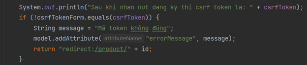

#### Cách 3: Tuyên truyền cho người dùng cách sử dụng Website
Cách sử dụng Website: khi không muốn sử dụng Website thì hãy đăng xuất tài khoản.

# 3. Brute Force
Brute force là một trong những hình thức phổ biến nhất của password attack và dễ dàng nhất để thực hiện. Brute force thường là biện pháp cuối cùng của hacker nếu các kỹ thuật trước đó thất bại đơn giản vì đây là công cụ tốn nhiều thời gian nhất. Sử dụng các chương trình máy tính để đăng nhập vào tài khoản người dùng dò tìm username và password.

Nếu website được thiết kế để người dùng tự đặt mật khẩu mà không có bất kỳ ràng buộc nào sẽ khiến cho mật khẩu có tính bảo mật yếu, từ đó hacker có thể sử dụng các tool để dò tìm mật khẩu

Cách tốt nhất chính là thêm những ràng buộc. 

```
@PostMapping
    public String registerUser(@RequestParam("userName") String userName,
                               @RequestParam("accountName") String accountName,
                               @RequestParam("email") String email,
                               @RequestParam("password") String password,
                               @RequestParam("repeatPassword") String repeatPassword,
                               @RequestParam("_csrfToken") String _csrfToken,
                               Model model) {
        if(containsUTF8(userName) && containsAllowedCharacters(accountName)
                && containsAllowedCharacters(email) && isStringLengthLessThan50(userName)
                && isStringLengthLessThan50(accountName) && isStringLengthLessThan50(password)){
            //        System.out.println("Sau khi nhan nut dang ky thi csrf token la: " + csrfToken);
            if (!_csrfToken.equals(csrfToken)) {
//            System.out.println("csrfToken form: " + _csrfToken);
                String message = "Anti-CSRF token is not correct";
//            System.out.println(message);
                model.addAttribute("errorMessage", message);
                model.addAttribute("_csrfToken", csrfToken);
                return "user/boot1/register";
            }
            System.out.println(password);
            if (password.length() >= 8 && password.matches(".*[A-Z].*")
                    && password.matches(".*\\d.*") && password.matches("^(?=.*[@#$%^&+=]).*$")){
                try {
                    userService.registerUser(userName, accountName, email, password, repeatPassword);
                } catch (AccountNameExistException ex) {
                    model.addAttribute("errorMessage", ex.getMessage());
                    return "user/boot1/register";
                } catch (PasswordDoNotMatchException ex) {
                    model.addAttribute("errorMessage", ex.getMessage());
                    return "user/boot1/register";
                } catch (Exception ex) {
                    ex.printStackTrace();
                }
                String message = "Register Successfully! Login now!";
                model.addAttribute("message", message);
                return "user/boot1/register";
            }
            else{
                String message = "The password must have a minimum length of 8 characters, including at least one uppercase letter, at least one digit, and exactly one special character.";
                model.addAttribute("errorMessage", message);
                model.addAttribute("_csrfToken", csrfToken);
                return "user/boot1/register";
            }
        }
        else {
            String message = "Username can only contain lowercase letters; email, name can only contain lowercase letters, and the characters '()', '@', and the length must be more than 8 and less than 50 symbols.";
//            System.out.println(message);
            model.addAttribute("errorMessage", message);
            model.addAttribute("_csrfToken", csrfToken);
            return "user/boot1/register";
        }
    }
```

Mình đã thêm các ràng buộc vào mật khẩu bao gồm:
- Mật khẩu có chiều dài ít nhất 8 ký tự
- Mật khẩu có ít nhất một ký tự viết hoa, có 1 số
- Mật khẩu có duy nhất một ký tự đặc biệt

Ví dụ: Duc2112002@

Code điều kiện tương ứng (mình sử dụng các quy tắc định dạng chuỗi (regular expression) để kiểm tra tính hợp lệ của mật khẩu):

```
password.length() >= 8 && password.matches(".*[A-Z].*")
                    && password.matches(".*\\d.*") && password.matches("^(?=.*[@#$%^&+=]).*$")
```

Trong đó:
- password.length() >= 8: Mật khẩu phải có độ dài ít nhất là 8 ký tự.
- password.matches(".*[A-Z].*"): Mật khẩu phải chứa ít nhất một ký tự in hoa.
- password.matches(".*\\d.*"): Mật khẩu phải chứa ít nhất một chữ số.
- password.matches("^(?=.*[@#$%^&+=]).*$"): Mật khẩu phải chứa ít nhất một ký tự đặc biệt từ tập hợp @#$%^&+=.

Demo:
Mình sẽ đăng ký một tài khoản có mật khẩu là duc2112002

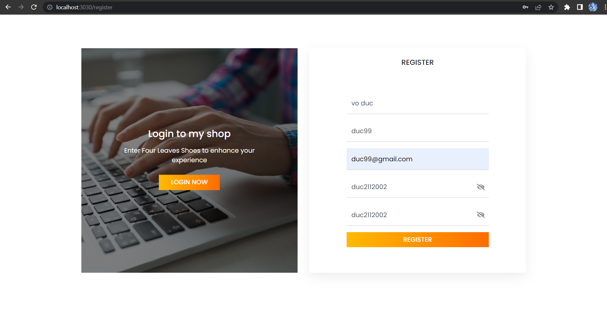

Thông báo nhận được sẽ là: "The password must have a minimum length of 8 characters, including at least one uppercase letter, at least one digit, and exactly one special character."

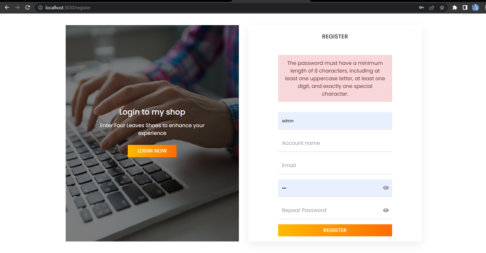

# 4.XSS
Cross-site scripting là một lỗ hổng phổ biến trong ứng dụng web. Để khai thác một lỗ hổng XSS, hacker sẽ chèn mã độc thông qua các đoạn script để thực thi chúng ở phía client. XSS xảy ra khi ứng dụng web không đánh giá đúng các dữ liệu đầu vào từ người dùng và cho phép chèn mã JavaScript hoặc HTML độc hại vào các trang web. Khi người dùng truy cập vào trang web bị tấn công, mã độc hại sẽ được thực thi trên trình duyệt của họ, thường là một đoạn mã JavaScript, và có thể gây ra những hậu quả nghiêm trọng như đánh cắp thông tin người dùng, chiếm quyền kiểm soát tài khoản, hoặc thực hiện các hành động trái phép trên trang web.

Có 3 loại tấn công XSS bao gồm Reflected XSS, Stored XSS, DOM Based XSS. Mình sẽ demo tấn công Stored XSS vào phần bình luận của sản phẩm.

Vào phần bình luận của sản phẩm, nhập code javascript để lưu bình luận đó vào database, mỗi lần user load trang sản phẩm sẽ bị thấy thông báo đó.

```
<script>alert("Tôi là hacker");</script>
```

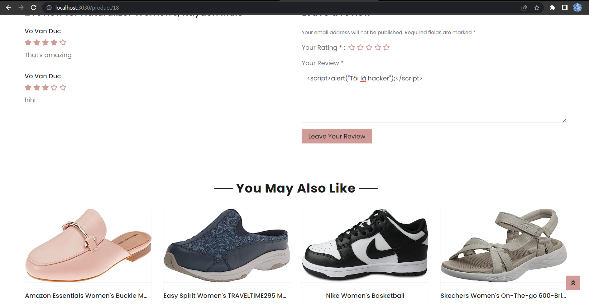

Thông thường website đã lưu những đoạn mã độc này vào cơ sở dữ liệu, tuy nhiên vì website đã được bảo vệ nên sẽ nhận được thông báo như sau: "The comment content should only consist of lowercase letters, numbers, '@' symbol, parentheses, commas, periods, exclamation marks, and spaces."

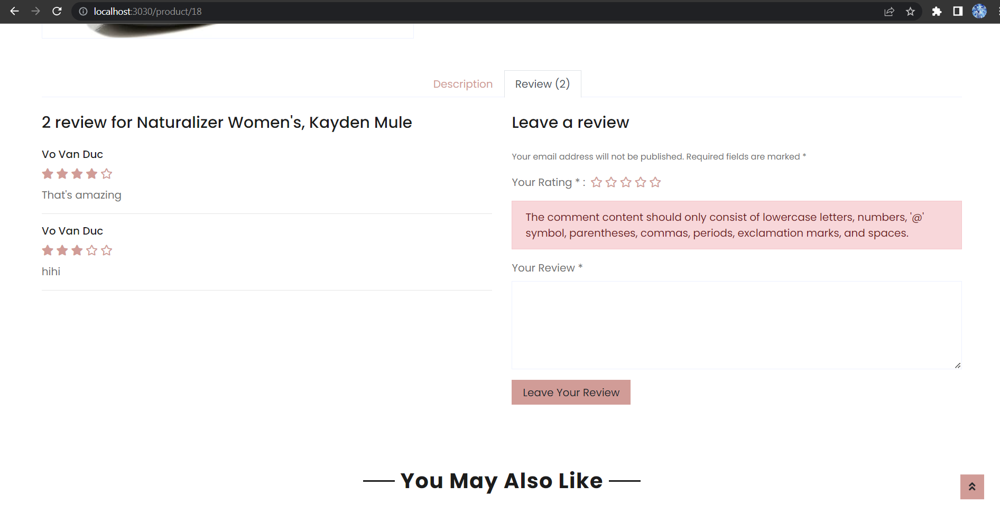

#### Cách phòng chống
#### Cách 1: Sử dụng Thymeleaf

Sử dụng Thymeleaf, vì các biện pháp bảo mật mà Spring boot và Thymeleaf thực hiện sẽ vô hiệu hoá các cuộc tấn công XSS. Spring boot và Thymeleaf mặc định có cơ chế bảo mật là thực hiện mặc định việc escape các giá trị trong thuộc tính HTML.

Escape là quá trình chuyển đổi các ký tự đặc biệt và các ký tự có ý nghĩa trong HTML thành các mã thay thế an toàn (HTML entities).

Ví dụ nhập bình luận là 
```
<script>alert('Hello!')</script> 
```
sẽ chuyển thành 
```
&lt;script&gt;alert(&#39;Hello!&#39;)&lt;/script&gt;
```

Vì thế, thay vì sử dụng các thuộc tính th:utext, th:scr, th:onclick thì nên sử dụng th:text, th:alt, th:title, th:placeholder,…
Ví dụ chỗ hiển thị nội dung bình luận, không nên sử dụng th:utext

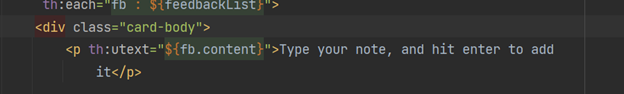

Thay vào đó hãy sử dụng th:text

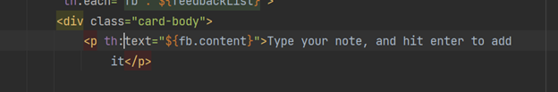

Tuy nhiên, nếu chỉ sử dụng cơ chế Escape thì những dòng code độc đó vẫn sẽ được lưu xuống database, chỉ là chúng không thể tự thực hiện chứng năng của chúng. Vì thế cần phải sử dụng những điều kiện cho những bình luận hợp lệ.

#### Cách 2: Sử dụng điều kiện để người dùng chỉ được phép nhập bình luận hợp lệ

```
if (!inputService.isValidComment(content)){
            String message = "The comment content should only consist of lowercase letters, numbers, '@' symbol, parentheses, commas, periods, exclamation marks, and spaces.";
            errorMessage = message;
            model.addAttribute("errorMessage", message);
            return "redirect:/product/" + id;
        }
```

```
public boolean isValidComment(String input) {
        return input.matches("^[\\p{L}@(),.!\\s]{1,100}$");
    }
```

# 5.ClickJacking và sử dụng HandlerInterceptor

Clickjacking là một hình thức tấn công web đánh lừa người dùng vô ý nhấp chuột vào một đối tượng website. Khi người dùng nhấn vào website hacker đó, họ sẽ nghĩ là họ đang theo tác trang chính chủ nhưng thực chất họ đang thao tác trên một website khác, được làm mờ bằng CSS hoặc biện pháp nào đó. Clickjacking có thể được sử dụng để đánh cắp tài khoản người dùng, lừa click vào quảng cáo để kiếm tiền, tự ý đăng các bài viết vào diễn đàn,...

Cách hoạt động:
Hacker sẽ tạo ra một website giả có domain gần giống với domain của web chúng ta, giao diện sẽ lấy từ một trang của đó của web. Sau đấy, hacker sẽ làm ẩn đi một liên kết chứa website thứ 3 mà chúng muốn, bất kể khi ta nhấp chuột trên website giả mạo đó thì trình duyệt sẽ gửi một request đến website thứ 3, mà request này người dùng không biết gì về nó.

## HandlerInterceptor
HandlerInterceptor là một thành phần trong Spring MVC framework cho phép bạn can thiệp vào quá trình xử lý của các request và response trong ứng dụng web. Nó cung cấp các phương thức cho phép thực hiện các hành động trước và sau khi một request được xử lý bởi controller và trước khi response được trả về cho client.

WebMvcConfigurer là một interface được sử dụng để cấu hình và tùy chỉnh các thành phần liên quan đến MVC trong ứng dụng web. Việc tùy chỉnh các thành phần liên quan đến MVC có thể bao gồm cấu hình xử lý các tài nguyên tĩnh như hình ảnh, CSS, javascript; cấu hình chuyển đổi dữ liệu; đăng ký các interceptor (interceptor là các hoạt động xử lý xảy ra trước và sau khi một yêu cầu được xử lý bởi controller (request, response))

Vì thế mình sẽ tạo ra 1 file XFrameOptionsInterceptor implements HandlerInterceptor để đăng ký interceptor nhằm mục đích quản lý thông tin của request khi nhận và response trước khi gửi.

```
@Configuration
public class WebMvcConfig implements WebMvcConfigurer {
    @Override
    public void addInterceptors(InterceptorRegistry registry) {
        registry.addInterceptor(new XFrameOptionsInterceptor());
    }
```

Trong file XFrameOptionsInterceptor, ta sẽ cấu hình cho response

```
response.setHeader("X-Frame-Options", "SAMEORIGIN");
```

Header X-Frame-Options được sử dụng để xác định chính sách về việc nhúng (embedding) trang web trong một frame hoặc iframe. Giá trị "SAMEORIGIN" trong mã trên chỉ ra rằng trang web chỉ được nhúng trong các frame hoặc iframe từ cùng một nguồn gốc (origin) với trang web hiện tại. Điều này giới hạn việc nhúng trang web vào các frame hoặc iframe từ các nguồn khác.

Khi hacker muốn nhúng trang web của chúng ta vào trang web của chúng để lừa người khác thì sẽ bị chính sách của trang web chặn.


